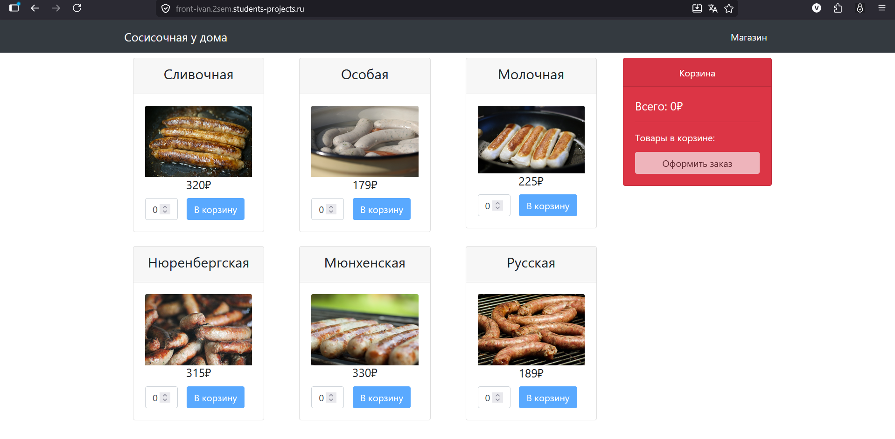
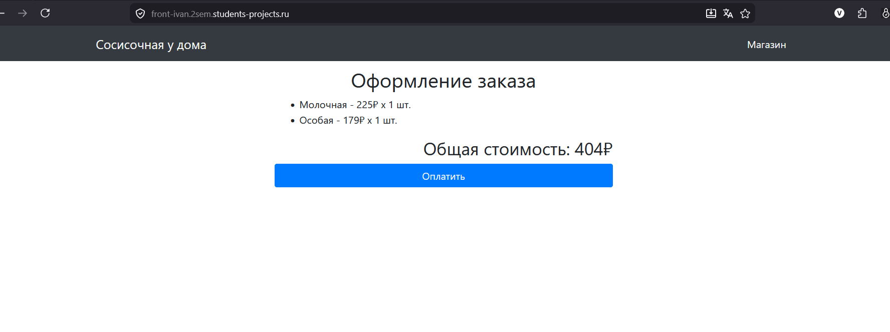
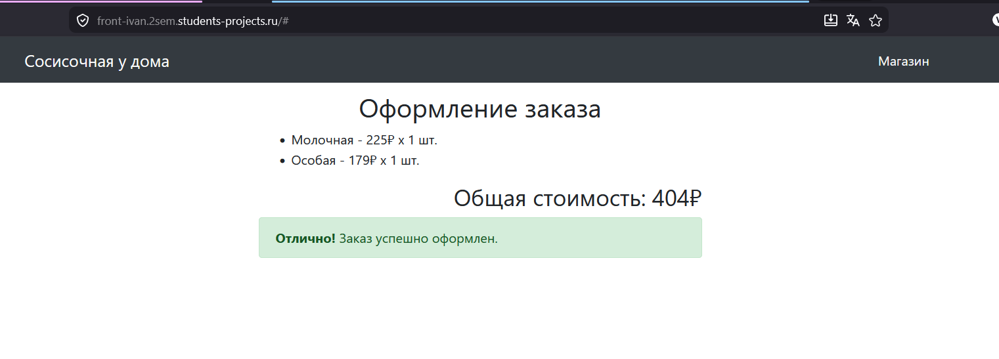

# Sausage Store


## Technologies used

* Frontend – TypeScript, Angular.
* Backend  – Java 16, Spring Boot, Spring Data.
* Database – H2.

## Installation guide
### Backend

Install Java 16 and maven and run:

```bash
cd backend
mvn package
cd target
java -jar sausage-store-0.0.1-SNAPSHOT.jar
```

### Frontend

Install NodeJS and npm on your computer and run:

```bash
cd frontend
npm install
npm run build
npm install -g http-server
sudo http-server ./dist/frontend/ -p 80 --proxy http://localhost:8080
```

Then open your browser and go to [http://localhost](http://localhost)

---

## HELM

Проект поддерживает деплой в K8S кластер с через пакетный менеджер HELM.

### Helm-чарт

Helm-чарт представлен в папке sausage-store-chart

values.yaml - определены основные переменные чарта и зависимостей.
Chart.yaml - указана версия чарта, приложения и определены зависимости:
- backend - чарт бэкенда приложения, интегрирован с Vault;
- backend-report - чарт микросервиса, отвечающего за создание отчетов
- frontend - чарт фронта приложения
- infra - чарт с СУБД MongoDB и PostgreSQL, Job (post-install) для первичного создания пользователя в Mongo

#### backend

Чарт состоит из:
- deployment
- VPA (по умолчанию в режиме Off)
- service
- configMap (определены env, в т.ч. для подключения к Vault)
- Secret (хранит Vault-token)

#### frontend

Чарт состоит из:
- deployment
- configMap (конфиг для nginx)
- ingress
- service

#### backend-report

Чарт состоит из:
- deployment
- HPA
- configMap (порт приложения)
- secret (строка для подключения к MongoDB)

#### infra

Чарт состоит из:
- statefulSet для PGSQL
- Headless service для PGSQL
- configMap для PGSQL
- statefulSet для MongoDB
- Headless service для MongoDB
- configMap для MongoDB
- Job для создания БД и пользователя в MongoDB

### Деплой в кластер

Для деплоя Helm-чарта в кластер K8S необходимо:

1. Предварительно создать docker-образы  для backend, frontend, backend-report и отправить их в ваш docker-hub командами:

```
docker build ./backend -t <YOUR_DOKERHUB>/sausage-backend:latest --build-arg VERSION=<VERSION>
docker push <YOUR_DOKERHUB>/sausage-backend:latest
docker build ./frontend -t <YOUR_DOKERHUB>/sausage-frontend:latest
docker push <YOUR_DOKERHUB>/sausage-frontend:latest
docker build ./backend-report -t <YOUR_DOKERHUB>/sausage-backend-report:latest
docker push <YOUR_DOKERHUB>/sausage-backend-report:latest
```

2. Собрать Helm-чарт командой:

```
helm packege ./sausage-store-chart -d /path/to/save
```

После чего архив будет лежать в директории, указанной в качестве значения флага -d

3. Установить/обновить Helm-чарт в кластер (необходимо предварительно настроить kubectl для подключения к кластеру):

```
helm upgrade --install /path/to/sausage-store-0.1.0.tgz
```

# Пример успешной устаноки чарта:

Поды и завершенная Job:
```
kubectl get pods
NAME                                            READY   STATUS      RESTARTS      AGE
db-user-create-hxfqk                            0/1     Completed   3             70m
mongodb-0                                       1/1     Running     0             71m
postgresql-0                                    1/1     Running     0             71m
sausage-store-backend-57f569d76b-sdncx          1/1     Running     1 (70m ago)   71m
sausage-store-backend-report-5c8b84b899-g7chb   1/1     Running     2 (70m ago)   71m
sausage-store-frontend-777d4fbb88-rk5tr         1/1     Running     0             71m
```

HPA:
```
kubectl get hpa 
NAME                               REFERENCE                                 TARGETS       MINPODS   MAXPODS   REPLICAS   AGE
sausage-store-backend-report-hpa   Deployment/sausage-store-backend-report   cpu: 0%/90%   1         3         1          73m
```

VPA:

```
root@vault-vm:/home/ivan# kubectl describe vpa sausage-store-backend-vpa
Name:         sausage-store-backend-vpa
Namespace:    r-devops-magistracy-project-2sem-271385821
Labels:       app.kubernetes.io/managed-by=Helm
Annotations:  meta.helm.sh/release-name: sausage-store
              meta.helm.sh/release-namespace: r-devops-magistracy-project-2sem-271385821
API Version:  autoscaling.k8s.io/v1
Kind:         VerticalPodAutoscaler
Metadata:
  Creation Timestamp:  2026-07-02T09:53:58Z
  Generation:          1
  Resource Version:    308658834
  UID:                 6ae6540d-872e-4116-b595-db72371e8cf8
Spec:
  Target Ref:
    API Version:  apps/v1
    Kind:         Deployment
    Name:         sausage-store-backend
  Update Policy:
    Update Mode:  Off
Status:
  Conditions:
    Last Transition Time:  2026-07-02T09:54:13Z
    Status:                True
    Type:                  RecommendationProvided
  Recommendation:
    Container Recommendations:
      Container Name:  backend
      Lower Bound:
        Cpu:     25m
        Memory:  262144k
      Target:
        Cpu:     25m
        Memory:  272061154
      Uncapped Target:
        Cpu:     25m
        Memory:  272061154
      Upper Bound:
        Cpu:     30m
        Memory:  748085530
Events:          <none>
```
Ingress:

```
root@vault-vm:/home/ivan# kubectl get ingress
NAME                             CLASS   HOSTS                                  ADDRESS          PORTS     AGE
sausage-store-frontend-ingress   nginx   front-ivan.2sem.students-projects.ru   158.160.176.69   80, 443   76m
```

Веб-интерфейс



Корзина



Оформление заказа

